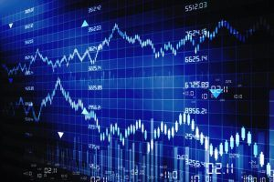
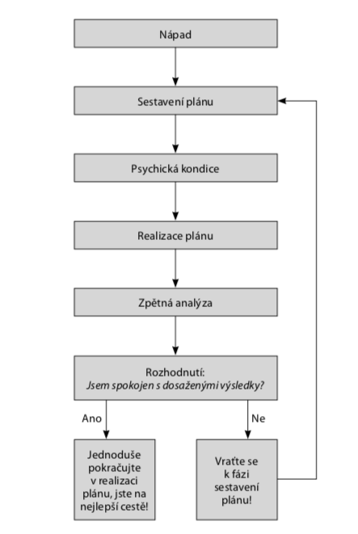

# Uvod do tradingu
Obchodovani na financnich trzich lze zaradit mezi klasicky byznys a celkove principy jsou do jiste miry velmi podobne, jako kdyz se budujeme firmu. Navic se jedna o nejspravedlivejsi a nejferovejsi byznys, ktery v dnesni dobe existuje.

	

**Pri obchodovani muzou nastat dva pripady:**

1.	Delame chyby a tim prodelavame -> ztracime cas i penize
2. 	Delame racionalni rozhodnuti a dari se nam, diky tomu svuj investovany cas a hlavne finance zhodnocujeme -> vydelavame penize

Vetsina chyb a naslednych ztrat prameni pouze a jen z nas samotnych, pouze vy muzete za to, ze vydelavate ci nikoli. V investicich mate za jakekoli situace pravo na rozhodnuti podle sveho nejlepsiho uvazeni. Za kazde investicni rozhodnut ale nesete zodpovednost ve forme celkoveho vysledku.

Uspech a uznani dosahnout jen ti nejlepsi, podobne jako v podnikani jen 10-20% podnikatelu je dlohodobe ziskovych. Podle svych individualnich moznosti si muzete zvolit, jakym stylem chcete obchodovat, kolik ze sveho casu budete obchodovani venovat a jak velky psychycky napor unesete.

### S cim lze obchodovat ?
* Akcie - cenne papiry firem
* Komodity - zlato, stribro, platina
* Futures - obchod o obchodu budoucim
* Forex - menove pary

### Co je potreba ?
* Nadseni
* Obchodiho ducha
* Odvahu
* Disciplinu
* Ochotu se ucit a vzdelavat

## Co jsou investice ?
Ulozeni(obetovani) neceho s vidinou potencialniho budouciho zisku. Investovani nejcasteji spojujeme s financemi, tedy ulozeni casti volnych prostredku.Investovat lze krom hmotnych veci i nehmotne, napriklad cas do vzdelavani s vidinou lepsich prilezitosi v pracovnim svete ci osobnim zivote. Hlavnim cilem investovani je tedy vzdy zisk.

**Poznamka:** Investovani jednoznacne neni jakykoli druh sporeni, ve svete investic prave vlozenim urcite castky tuto sumu riskujeme a jeji navratnost nikdy neni a nikdy nebude nikym zarucena.

## Faze v Tradingu vs klasickem podnikani

### Napad
Prvni krokem, kterym zaciname, spociva v tom, ze mame nejaky napad ci vizi. V buznysu to muze byt naprosto cokoli, od noveho vynalezu po zdokonalovani jiz zabehnutych vyrobku a sluzeb. Ve svete tradingu to muze byt zhodnotit pocatecni vlozeny kapital napr. o 1% mesicne.

### Sestaveni planu
V byznysu dale nas napad dukladneji rozpracujeme. Predstavujeme si, jak by mohl vysledny vyrobek vypadat nebo sluzba vyuzivana klienty a pripravime vse potrebne pro realizaci napadu. Tudiz v tomto kroku si uz sestavime a sepise konkretni plany. V tradingu to nazyvame obchodni strategie, kdy sestavime kompletni investicni plan.

### Psychicka kondice
Nez zacneme realizovat nami sestavene plany, tak musime nejdrive zajistit vsechny nepostradatelne zdroje (fyzicke, financni a v neposledni rade mentalni). Pripravenost je psychicka kondice a je velmi nutna pro naslednou realizaci planu.

### Realizace planu
Ve chvili, kdy je napad soucasti kompletniho planu a mame pripraveny vsechne nepostradatelne zdroje, muzeme se opet pohnout smerem vpder. Prejdeme do faze kompletni realizace vsech pripravenych planu a aktivit. Nasledne tak zaciname poskytovat sluzby ci vyvinute produkty.

Ve svete investic se ma situace temer uplne stejne, realizujeme nas pripraveny plan, podle kterho se ridime. Snazime se co nejlepe investicne rozhodovat (neustale otevirani a uzavirani obchodu) a stejne jako v klasickem podnikani z nasi cinnosti profitovat (zhodnocovat pocatecni kapital).

Faze sestaveni plaanu a realizace planu jsou stejne dulezite, v uspesnem pusobeni na financnich trzich potrebujeme oboji.

### Zpetna analyza
Po realizaci veskerych planu, uvedeni vyrobku na trh a poskytovani pripadnych sluzeb nasleduje zpetna analyza a vyhodnoceni. Jedna se o zpetnou vazbu, ktera nam jednoznacne ukazuje, jak jsme si v prubehu realizce vedli a co bychom idealne mohli vylepsit, abychom byly jeste uspesnejsi a profitabilnejsi.

### Rozhodnuti
Poslednim krokem je samotne rozhodnuti a promysleni dalsiho pokracovani. V tomto kroku procteme a zanalyzujeme obchodni denik do posledni tecky a pote stanovime budouci vyvoj. Klicova otazka je: "Jsem spokojen s dosazenymi vysledky?". Odpovidame jednoznacne ANO, v aktivite dale pokracujeme nebo NE a vracime se znova k sestavovani planu. Cil nechavame, pouze menime cestu jak se k cili dostat.

	

Cilem kapitoly spociva v priblizeni skutecnosti, ze stejne jako firmu musime neustale budovat i sve plany ve svete investic musime dal a dal rozvijet. Nelze pouze prijit k obchodni platforme a pozadovat zazraky, musite se neustale zlepsovat a neustale stavet svuj byznys jmenem Trading.

**K uspesnemu obchodovani na financnich trzich je treba zvladnout obchodni plan, psychologii a money management to je cesta k dlouhodobe profitabilite.**

## Investor vs Trader
### Investor
Clovek investujici urcity objem neceho (penez) s cilem dosazenim budouciho zhodnoceni nebo zisku v dlouhodobejsim horizontu napr. roku. Casto uplatnuje strategii "buy nd hold"

### Trader
Spekulant na financnich trzich, respektive jedna se o konkretni typ investora. Trader jako investor investuje zpravidla finance s cilem budouciho zhodnoceni, ale na rozdil od investora se zameruje na kratsi casove useky (minuty, den, mesic)

## Investovani a obchodovani podle narocnosti
Obchodni styly lze rozdelit od nejmene casove narocnych zpusobu obchodovani s snizsim potencialnim ziskem, ale i rizika, k nejnarocnejsim formam tradingu s velkym potencialem zisku a samozrejme i rizika.

	

### Investovani
Dlouhodova obchodni strategie, ktera je zalozena predevsim na fundamentalni analyze. Obchodni instrumenty jsou drzeny v radech mnoha mesicu az roku. Znamy investor v teto skupine je Warren Buffett.

### Pozicni obchodovani
Budovani obchodnich pozic ve vybranych, fundamentalne podlozenych instrumentech, se stanovenymi technickymi hladinami k nakupum a prodejum. Obchody jsou drzeny v radech tydnu az mesicu.

### Swingove obchodovani
Tradingovy styl obchodovani, kdy jsou pozice drzeny jen v ramci nekolika malo dni ( nebo hodin). Pozice jsou vybirany predevsim na zaklade technicke analyzy. Nejcastejsi jsou pouzivany nastroje technicke nastroje jako supporty a rezistence urovne, trendove cary a technicke patterny. Statisticky nejziskovejsi forma tradingu.

### Intradenni obchodovani
Tradingovy styl, kdy obchodnik zacina kazdy den takzvane "s cistym stolem". Pozice zasadne nedrzi do druheho dne, pred zaverem trhu je intradenni trader striktne uzavira. Nejcasteji se obchoduje v 5, 10, 16 ci 30 minutovych usecich.

Vyhodou intradenniho tradingu je cista hlava po ukonceni obchodniho dne, kdy dalsi den zacina obchody uplne odznova nezavisle na predchozim dnu. Nevyhodou je nezachyceni dulezitych, nekolikadennich ci tydennich trendu ve vetsim rozsahu.

### Scalping
Tradingovy styl, kdy jsou pozice obchodnikem drzeny jen nekolik sekund ci nekolik malo minut. Jde o velmi rizikovy styl obchodovani.

## Kapital pro obchodovani na financnich trich
V tradingu muzeme zacit obchodovat s mnohem nizsim vstupnim kapitalem, nez by bylo potrebne u vetsiny jinych byznysu.

Jako pocatecni kapital k obchodovani postacuje castka cca 100 000 Kc, na ziskani praxe a obchodnik navyku.

Na seriozni trading a trvalejsi zikove obchodovani je vhodnejsi obchodovat s vetsim uctem nad 200 000 Kc.

Kapital 10 000 Kc, bych doporucil jedine tehdy, pokud byste zacali obchodovat na forexu. Jeho obrovskou vyhodou je, ze dovoluje zacit s mini a mikroloty, kde obchodujete jen zlomek velkosti lotu.

## Zakladni objednavky na financnich trzich
### Trzni prikaz / okamzita realizace (market)
Pokyn k nakupu nebo prodeji pozadovaneho mnozstvi lotu, kontraktu nebo mnozstvi cennych papiru na zaklade nejvyhodnejsiho kurzu v dobe doruceni pokynu na trh.

1. Nakupujeme (long position): levne nakup a pote draze prodej
2. Prodavame (short position): nejprve draze prodej a pote levne nakup

### Zastaveni ztrat (stop loss)
Predem definovana krajni hranice, pri niz dobrovolne inkasujeme malou ztratu drive, nez se rozroste do ztraty obri. 
Je to oblast, za kterou se nam ukonci otevrene pozice se ztratou, kterou si predem stanovime. Jedna se o zakladni ochranu proti krachu.

### Take profit, profit target (realizace zisku)
Jedna se o prikaz, ktery umistime na cenu, pri niz chceme realizovat zisk z nasi otevrene pozice. Prikaz urc na jake cene broker ukonci nasi otevrenou pozici se ziskem.
