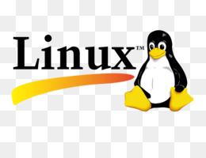
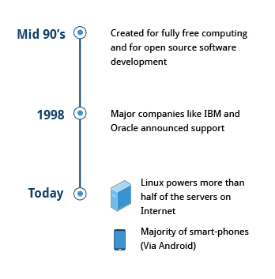
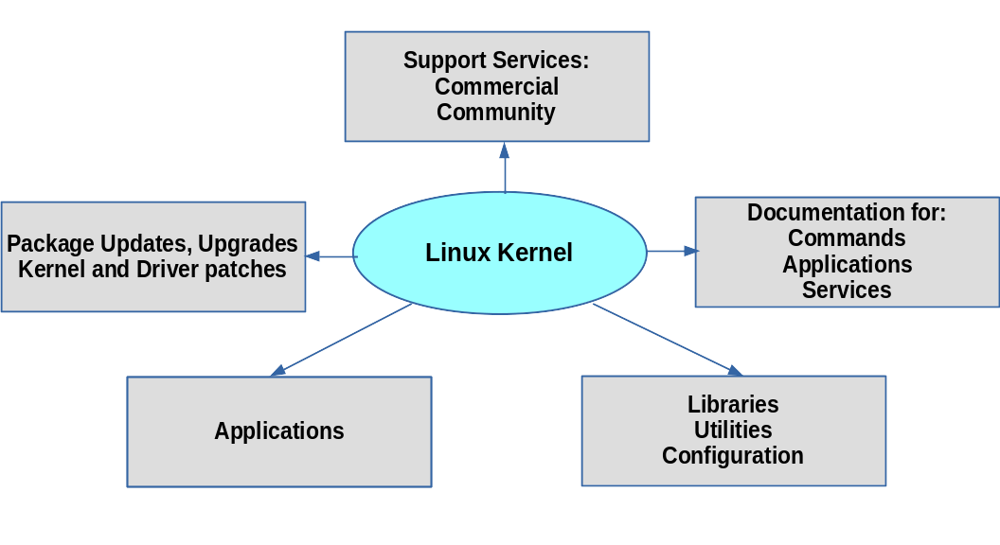
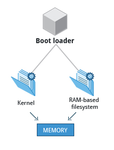

# Introduction into Linux

Table of contents
=================

<!--ts-->
   * [What is Linux?](#whatIsIt)
   * [History](#history)
   * [Philosophy](#philosophy)
   * [Terminology](#terminology)
   * [Distributions](#distributions)
   * [Boot process](#bootProcess)
   * [Linux filesystems](#linuxFilesystems)
   * [Terminal](#terminal)
	* [Linux commands for file system management](#linuxCommandsForFileSystemManagement)
   	* [Linux commands for text processing](#linuxCommandsForTextProcessing)
   	* [Linux commands for process management](#linuxCommandsForProcessManagement)
   	* [Linux commands for BASH and user environment ](#linuxCommandsForBASH)
   	* [Linux commands for help / documentation](#linuxCommandsForDocumentation)
   	* [Linux commands for network](#linuxCommandsForNetwork)
  * [Package management system](#packageManagementSystem)
  * [Streams](#streams)
  * [Process](#process)
  * [Text editors](#textEditors)
  * [User environment](#userEnvironment)
<!--te-->

<a name=whatIsIt></a>
## What is Linux?
Linux is an open source computer operating system, initially developed on and for Intel x86-based personal computers. It has been subsequently ported to an astoundingly long list of other hardware platforms, from tiny embedded appliances to the world's largest supercomputers.

<div align="center">
	
</div>

<a name=history></a>
## History
Linus Torvalds was a student in Helsinki, Finland, in 1991, when he started a project: writing his own operating system kernel. He also collected together and/or developed the other essential ingredients required to construct an entire operating system with his kernel at the center. It wasn't long before this became known as the Linux kernel. 

In 1992, Linux was re-licensed using the General Public License (GPL) by GNU (a project of the Free Software Foundation or FSF, which promotes freely available software), which made it possible to build a worldwide community of developers. By combining the kernel with other system components from the GNU project, numerous other developers created complete systems called Linux distributions in the mid-90’s.

The Linux distributions created in the mid-90s provided the basis for fully free (in the sense of freedom, not zero cost) computing and became a driving force in the open source software movement. In 1998, major companies like IBM and Oracle announced their support for the Linux platform and began major development efforts as well.

Today, Linux powers more than half of the servers on the Internet, the majority of smartphones (via the Android system, which is built on top of Linux), and all of the world’s most powerful supercomputers.

Linus named his OS kernel Linux and shows a penguin as it mascot after a little incident at the zoo.

<div align="center">
	
</div>

<a name="philosophy"></a>
## Philosophy
Linux is constantly enhanced and maintained by a network of developers from all over the world collaborating over the Internet, with Linus Torvalds at the head. Technical skill, a desire to contribute, and the ability to collaborate with others are the only qualifications for participating.

Linux borrows heavily from the well-established UNIX operating system. It was written to be a free and open source system to be used in place of UNIX, which at the time was designed for computers much more powerful than PCs and was quite expensive. Files are stored in a hierarchical filesystem, with the top node of the system being the root or simply "/". Whenever possible, Linux makes its components available via files or objects that look like files. Processes, devices, and network sockets are all represented by file-like objects, and can often be worked with using the same utilities used for regular files. Linux is a fully multitasking (i.e. multiple threads of execution are performed simultaneously), multiuser operating system, with built-in networking and service processes known as daemons in the UNIX world.

__Note__: Linux was inspired by UNIX, but it is not UNIX.

<!-- break page -->
<div style="page-break-after: always;"></div>

<a name="terminology"></a>
## Terminology
**Kernel**: glue between hardware and applications. It controls the hardware and makes the hardware interact with the applications.

**Distribution**: collection of programs combined with the Linux kernelto make up a Linux-based operating system. For example: Redhat, Fedora, Ubuntu and Gentoo.

**Boot loader**: program that boots the operating system. Two examples of a boot loader are GRUB and ISOLINUX.

**Service**: program runs as a background process, some examples of the service are httpd, ftpd and named.

**Filesystem**: method for storing and organizing files, some examples of filesystems are ext3, ext4 and FAT.

**X Window system**: standard toolkit for build graphical subsystem on nearly all Linux systems.

**Desktop environment**: graphical user interface on top of the operating system (GNOME, KDE, Xfce)

**Command line**: interface for typing commands on top of the operating system

**Shell**: command line interpreter that interprets the command line input and instruct the operating system to perform any necessary tasks and commands.

<a name="distributions"></a>
## Distributions
The Linux kernel is the core of the operating system. A full Linux distribution consists of the kernel plus a number of other software tools for file-related operations, user management, and software package management. 

<div align="center">
	
</div>

Large organizations, such as companies and governmental institutions and other entities, tend to choose the major commercially-supported distributions from Red Hat, SUSE, and Canonical (Ubuntu).

CentOS is a popular free alternative to Red Hat Enterprise Linux (RHEL) and is often used by organizations that are comfortable operating without paid technical support. Ubuntu and Fedora are widely used by developers and are also popular in the educational realm. Scientific Linux is favored by the scientific research community for its compatibility with scientific and mathematical software packages. Both CentOS and Scientific Linux are binary-compatible with RHEL; i.e. in most cases, binary software packages will install properly across the distributions.

### Base distributions
* Debian (extends Ubuntu, Lubuntu)
* Fedora
* Suse

### Questions to ask when choosing a distributions
* What is the main function of the system (server or desktop)?
* What types of packages are important to the organization? For example, web server, word processing, etc.
* How much hard disk space is required and how much is available? For example, when installing Linux on an embedded device, space is usually constrained.
* How often are packages updated?
* How long is the support cycle for each release? For example, LTS releases have long-term support.
* Do you need kernel customization from the vendor or a third party?
* What hardware are you running on? For example, it might be X86, ARM, PPC, etc.
* Do you need long-term stability? Can you accept (or need) a more volatile cutting edge system running the latest software?

<a name="bootProcess"></a>
## Boot process
The Linux boot process is the procedure for initializing the system. It consists of everything that happens from when the computer power is first switched on until the user interface is fully operational. 

1. **First step - BIOS**
	* Starting an x86-based Linux system involves a number of steps. When the computer is powered on, the Basic Input/Output System (BIOS) initializes the hardware, including the screen and keyboard, and tests the main memory. This process is also called POST (Power On Self Test).

	* The BIOS software is stored on a ROM chip on the motherboard. After this, the remainder of the boot process is controlled by the operating system (OS).

1. **Master Boot Record (MBR) and Boot Loader**
	* Master Boot Record Once the POST is completed, the system control passes from the BIOS to the boot loader. The boot loader is usually stored on one of the hard disks in the system, either in the boot sector (for traditional BIOS/MBR systems) or the EFI partition (for more recent (Unified) Extensible Firmware Interface or EFI/UEFI systems). For Linux exists many bootloaders as GRUB, ISOLINUX or DAS.

1. **Load kernel**
	* The boot loader loads the selected kernel image and passes control to it. Kernels are almost always compressed, so its first job is to uncompress itself. After this, it will check and analyze the system hardware and initialize any hardware device drivers built into the kernel.


1. **Init RAM disk**
	* The initramfs filesystem image contains programs and binary files that perform all actions needed to mount the proper root filesystem, like providing kernel functionality for the needed filesystem and device drivers.

3. **Text mode login**
	* Near the end of the boot process, init starts a number of text-mode login prompts. These enable you to type your username, followed by your password, and to eventually get a command shell. However, if you are running a system with a graphical login interface, you will not see these at first.

<div align="center">
	
</div>

<a name="linuxFilesystems"></a>
## Linux filesystems
A filesystem is a method of storing/finding files on a hard disk (usually in a partition). 

Think of a refrigerator that has multiple shelves that can be used for storing various items. These shelves help you organize the grocery items by shape, size, type, etc. The same concept applies to a filesystem, which is the embodiment of a method of storing and organizing arbitrary collections of data in a human-usable form.

**Filesystems supported by Linux:**

* Conventional disk filesystems: ext2, ext3, ext4, XFS, Btrfs, JFS, NTFS, etc.
* Flash storage filesystems: ubifs, JFFS2, YAFFS, etc.
* Database filesystems
* Special purpose filesystems: procfs, sysfs, tmpfs, squashfs, debugfs, etc.

### The Filesystem Hierarchy Standard

Linux systems store their important files according to a standard layout called the Filesystem Hierarchy Standard (FHS), which has long been maintained by The Linux Foundation. Having a standard is designed to ensure that users, administrators, and developers can move between distributions without having to re-learn how the system is organized.

Linux uses the ‘/’ character to separate paths (unlike Windows, which uses ‘\’), and does not have drive letters. Multiple drives and/or partitions are mounted as directories in the single filesystem.

**Home**: each user has a home directory, usually placed under /home. Home directory contains some configuration files as .bash_profile for setting shell before login, .vimrc file for configure application Vim and etc.

**Bin**: directory contains executable binaries, essential commands used to boot the system or in single-user mode, and essential commands required by all system users, such as: ps, ls, grep.

**Sbin**: directory is intended for essential binaries related to system administration, such as fsck and shutdown.

**Proc**: directory contains virtual files(files exist only in memory) viewing configuration information.It does not contain real files, but runtime system information (e.g. system memory, devices mounted, hardware configuration, etc). Some important files in /proc are: cpuinfo, interrupts, meminfo, mounts, partitions, version.

**Dev**: directory contains device nodes, a type of pseudo-file used by most hardware devices, except for network devices.

**Var**: directory contains files represent log files, database, print queues and temporary folder. Temporary folder is deleted after reboot system.

**Etc**: directory is the home for system configuration files. It contains no binary programs, although there are some executable scripts. For example /etc/network, /etc/group or /etc/passwd.

**Boot**: directory contains the few essential files needed to boot the system.

**Lib** folder contains libraries (common code shared by applications and needed for them to run) for the essential programs in /bin and /sbin.

**Media**: directory is compose from removable devices as USB disks, CDs or DVDs.

**Usr**: directory tree contains theoretically non-essential programs and scripts added to system by users.

**Tmp**: temporary files; on some distributions erased across a reboot and/or may actually be a ramdisk in memory.

<div align="center">
	
</div>

<a name="terminal"></a>
## Terminal
Linux system administrators spend a significant amount of their time at a command line prompt. They often automate and troubleshoot tasks in this text environment. There is a saying, "graphical user interfaces make easy tasks easier, while command line interfaces make difficult tasks possible". Linux relies heavily on the abundance of command line tools. 

The command line interface provides the following advantages:

* No GUI overhead is incurred.
* Virtually any and every task can be accomplished while sitting at the command line.
* You can implement scripts for often-used (or easy-to-forget) tasks and series of procedures.
* You can sign into remote machines anywhere on the Internet.
* You can initiate graphical applications directly from the command line instead of hunting through menus.
* While graphical tools may vary among Linux distributions, the command line interface does not.

Most input lines entered at the shell prompt have three basic elements:

* Command
* Options
* Arguments

The command is the name of the program you are executing. It may be followed by one or more options (or switches) that modify what the command may do. Options usually start with one or two dashes, for example, -p or --print, in order to differentiate them from arguments, which represent what the command operates on.

However, plenty of commands have no options, no arguments, or neither. In addition, other elements (such as setting environment variables) can also appear on the command line when launching a task.

**Terminal emulator**

A terminal emulator program emulates (simulates) a standalone terminal within a window on the desktop. By this, we mean it behaves essentially as if you were logging into the machine at a pure text terminal with no running graphical interface. Most terminal emulator programs support multiple terminal sessions by opening additional tabs or windows.

**Virtual terminals**

Virtual Terminals (VT) are console sessions that use the entire display and keyboard outside of a graphical environment. Such terminals are considered "virtual" because, although there can be multiple active terminals, only one terminal remains visible at a time. A VT is not quite the same as a command line terminal window; you can have many of those visible at once on a graphical desktop.

To switch between VTs, press CTRL-ALT-function key for the VT. For example, press CTRL-ALT-F6 for VT 6. Actually, you only have to press the ALT-F6 key combination if you are in a VT and want to switch to another VT.

**Sudo**

The user with administrative (admin) privileges when required. sudo allows users to run programs using the security privileges of another user, generally root (superuser). The functionality of sudo is similar to that of run as in Windows.

<a name="linuxCommandsForFileSystemManagement"></a>
## Linux commands for file system management

### ls
By default, list the contents of the current directory. If you provide it a path, it will list the contents of that. Useful options to know are -l and -a, a long list format with more information and show hidden (dot) files, respectively.

```
ls -a			# list all files including hidden file starting with '.'
ls -d 			# list directories - with ' */'
ls -l			# list with long format - show permissions
ls -la			# list long format including hidden files
ls -lh			# list long format with readable file size

ls --colored		# colored list [=always/never/auto]
ls -R			# list recursively directory tree
ls -S			# sort by file size
ls -t			# sort by time & date
ls -X			# sort by extension name
```

### cat
If given a single file, prints its contents to the standard output. If you give it more than one file, it will concatenate them, and you can then redirect the output into a new file. Potentially useful is the -n option, which numbers the lines.

```
cat file.txt			# display contents of file
cat file1 file2			# view contents of multiple files in terminal
cat file.txt | less		# display contents of file gradually
cat > myFile.txt		# create a file with cat command
cat -n file.txt			# display line numbers in file

cat -T file.txt			# display tab separated lines in file
cat file1 > file2		# write content of file1 into file2
cat file1 >> file2		# appends content of file1 at end of file2
cat file1 file2 > file3		# redirecting multiple files contain in a single file
cat file1 file2 | sort > file3	# sorting contents of multiple files in a single file
```

### cd
Allows you to go from current directory to specified directory. Calling it without arguments returns you to your home directory. Calling it with two dots (cd ..) returns you to a directory “above” the current one, while calling it with a dash (cd -) returns you to the previous directory, regardless of where it’s located relative to the current one.

```
cd Documents				# change destination into directory Documents defined by relative path
cd home/user01/Documents		# change destination into directory Documents defined by absolute path 
cd ~					# change destination into user home directory
cd /					# change destination into root directory
```

### pwd
Prints your current directory. Useful if your prompt doesn’t contain this information, and especially useful in BASH programming for obtaining a reference to the directory in which you’re executing the code.

```
pwd		# print your current working directory
pwd -L		# print working directory from environment even if it contains symlinks
pwd -I		# print actual physical current working directory by resolving all symbolic links.
```

### mkdir
Create new directories. The most handy switch is -p, which creates the entire specified structure if it doesn’t exist already.

```
mkdir dogs			# create directory with name dogs in current directory
mkdir -p dir1/dir2/dir3		# parent directories (if non-existent) are created
```


### file
Tells you the type of a file. Since files in Linux aren’t under obligation to have extensions for the system to work (not that having extensions always helps), sometimes it’s hard for the user to know what type of file something is, and this little utility solves that problem.

```
file notes.txt			# determine file type
file note1.txt note2.txt	# determine type of multiple files
```

### cp
Copies files and directories. Since it doesn’t copy directories recursively by default, remember to use -r or -a. The latter preserves mode, ownership and time stamp info in addition to recursively copying.

```
cp main.c bak						# copy single file main.c to destination directory bak
cp main.c def.h /home/usr/rapid/			# copy 2 files main.c and def.h to directory rapid
cp *.c bak						# copy all C files in current directory to subdirectory bak
cp src /home/usr/rapid/					# copy directory src to directory rapid
cp -R dev bak						# copy all files and directories in dev recursively to directory bak
cp -f test.c bak					# force file copy
```

### mv
Moves or renames files and directories. Essentially, moving and renaming is one operation – renaming is just “moving” a single file to the same place under a different name.

```
mv names.txt fullnames.txt		# rename file name.txt onto fullnames.txt
mv -i names.txt fullnames.txt		# rename file, but prompts before overwriting
mv -n names.txt fullnames.txt		# rename file, but not overwrite an existing file
```

### rm
Stands for ‘remove‘ as the name suggests rm command is used to delete or remove files and directory in UNIX like operating system. If you are new to Linux then you should be very careful while running rm command because once you delete the files then you can not recover the contents of files and directory. Though there are some tools and commands through which deleted files can be recovered but for that you need expert skills.

```
rm linuxstufff.log		# delete the file
rm -i notes.txt			# delete files interactively
rm -d appdata/			# delete a empty directory
rm -r dbstore/			# deleting a directory recursively
rm -ri dbstore/			# delete the files and sub-directories interactively
rm -f tech.txt 			# deleting files forcefully
rm -f log{1..5}.txt		# delete files by reqular expression
rm -rf dbstore/			# deleting a directory recursively and forcefully
```

### ln
Creates hard or symbolic links between files. 

__Soft Link__:
Linux OS recognizes the data part of this special file as a reference to another file path. The data in the original file can be accessed through the special file, which is called as Soft Link.

__Hard Link__:
With Hard Link, more than one file name reference the same inode number. Once you create a directory, you would see the hidden directories “.” and “..” . In this, “.” directory is hard linked to the current directory and the “..” is hard linked to the parent directory.

```
ln -s /home/chris/src/library.so library.so		# create a symbolic link for a File
ln -s /home/chris/obj objects				# create a symbolic link for a directory
ln src_original.txt dst_link.txt			# create hard link for files
```


### chmod
Change user permissions. This refers to viewing, writing and executing files. A normal user may change permissions for files he owns. Permissions are defined in order "user", "group", and "other".

*	4 stands for "read",
*	2 stands for "write",
* 	1 stands for "execute"
*	0 stands for "no permission."

```
chmod 754 myfile		# set permission on myFile
```

__Note__: Here the digits 7, 5, and 4 each individually represent the permissions for the user, group, and others, each digit is a combination of the numbers 4, 2, 1, and 0.


### chown
The concept of owner and groups for files is fundamental to Linux. Every file is associated with an owner and a group. You can use chown and chgrp commands to change the owner or the group of a particular file or directory.

```
chown root tmpfile			# change the owner of a file
chown :friends tmpfile			# change the group of a file
chown himanshu:friends tmpfile		# change both owner and the group
```


### find
Search the filesystem for files or directories. Find is a very versatile and powerful command, not only because of its searching capabilities, but also because it allows you to execute arbitrary commands on matching (or non-matching, even) files.

```
find . -name file.txt		# find files using name in current directory
find /home -name tecmint.txt	# Find Files Under Home Directory
find /home -iname tecmint.txt	# Find Files Using Name and Ignoring Case
find / -type d -name Tecmint	# Find Directories Using Name
find . -type f -name "*.php"	# Find all PHP Files in Directory
```


### locate
Unlike find, locate searches the updatedb database for file name patterns. This database contains a snapshot of the filesystem. This makes locate very fast, but also unreliable – it cannot tell whether anything changed since the last snapshot.

```
locale file.txt			# find file in precomputed database files
locale -i "file.txt"		# find file by ignore case sensitive in precomputer database
locale "*.html" -n 20		# find just 20 result from your query
locale "*.html" -c		# display the number of matching entries
```

### du
Show file or directory size. Among the more useful options are -h, which converts the reported sizes into a more human-friendly format, -s which gives only a summary instead of the whole listing, and -d which controls the depth of directory recursion.

```
du -sh file.txt		# displays disk usage file.txt with human readable values (KB, MB, GB) 
du -ah			# displays disk usage of all files and folder in current directory
du -cah 		# displays disk usage of all files and folder in current directory with grand total disk space at the last line
```

### df
Show disk usage. The default output is good enough – it lists every filesystem, reports its size and the amount of used and available space – but you might want to tack on -h, which once again provides a more human-friendly report.

```
df -h 	# displays disk usage on all mounted volumes with human readable values (KB, MB, GB)
```

### dd
The dd command copies a file, converting the format of the data in the process, according to the operands specified. Its power comes from the flexibility – you can tell it the exact block size, it can copy around corrupted data, and it isn’t picky about devices – if you want to overwrite your hard drive with zeroes straight from /dev/zero, you’re welcome to do it. It’s also commonly used for creating live USB sticks from hybrid ISO images.

```
dd if=/dev/sda of=~/disk1.img		# create a ISO disc image from the CD in the computer
dd if=/dev/sda of=~/disk1.img		# create an img file of the /dev/sda hard drive
dd if=disk1.img of=/dev/sda		# restore backup image onto hard drive sda
dd if=/dev/zero of=/dev/sdX bs=1M	# securely erase a hard drive with zeroes
```


### mount / unmount
This pair takes care of mounting and unmounting filesystems. This can range from USB sticks to ISO images. Usually only root has mounting privileges.

```
mount /dev/sda5 /home/xp 	# mount sda5 drive on directory xp
umount /home/xp			# unmount drive sda5 from directory xp
```

<a name="linuxCommandsForTextProcessing"></a>
## Linux commands for text processing

### more and less
These two similar utilities allow you to view text chunked into screenfuls. Imagine a very long output from some command. Perhaps you called cat on a file and your terminal emulator took a few seconds to scroll all the text. Well, if you pipe it into one of these, you can now scroll it at your leisure. Less is newer and offers more options, so there is no reason to use more.

```
more file.txt		# sequentially read the content of file on the screen
cat file.txt | more 	# sequentially read the content of file on the screen
less file.txt		# sequentially read the content of file on the screen
cat file.txt | less 	# sequentially read the content of file on the screen
```	

### head and tail
Another pair, but here both halves have their uses. Head outputs a number of the first (“head”) lines of a file, while tail outputs a number of last (“tail”) lines of a file. The default number is ten, but this can be controlled via the -n option. Another useful switch is -f, which is short for “follow”, which continually outputs any appended lines – so, for instance, if you wanted to monitor a log file instead of constantly opening and closing it, you could use “tail -f /path/to/logfile”.

```	
head flavours.txt	# view the first 10 number of lines from given file
head -n 5 flavours.txt 	# view the first N number of lines from given file
head -5 flavours.txt 	# view the first N number of lines from given file

tail flavours.txt	# view the last 10 number of lines from given file
tail -n 5 flavours.txt	# view the last N number of lines from given file
tail -5 flavours.txt	# view the last N number of lines from given file
tail -f perf.log	# view appended lines of file instantly
```	

### grep
Grep, like all good Unix tools, does one thing, but does it well. It searches text for patterns. By default it looks at standard input, but you can specify files to be searched. A pattern can be a normal string or a regular expression. It can print out matching or non-matching lines, and their context. Every time you run a command which spews a lot of information you don’t need, pipe it into grep and let it do its magic.

```	
grep "this" demo_file			# Search for the given string in a single file
grep "string" FILE_PATTERN		# Checking for the given string in multiple files
grep -i "string" FILE			# Case insensitive search in file
grep -v "string" demo_file		# search lines in file does not contains given string
grep -A 3 -i "ex" demo_file		# display N lines after match
grep -B 3 -i "ex" demo_file		# display N lines before match
grep -C 3 -i "ex" demo_file		# display N lines aroung match

# Match regular expression in files
grep "lines.*empty" demo_file

# highlighting result of search
export GREP_OPTIONS='--color=auto' GREP_COLOR='100;8'
```	

### sort
Sorts lines of text by various criteria. Among the more useful, there’s -n, which sorts by the numeric value of a string, and -r, which reverses the output. An example of where this might come in handy is sorting du output – for example, if you wanted to see the files sorted in descending order according to size, you’d combine the two options.

```	
sort file.txt		# display sort the lines in this file alphabetically
sort -r file.txt	# display sort the lines in file revese order alphabetically
sort -n file.txt	# display sort the lines in this file numerically
sort -rn file.txt	# display sort the lines in this file reverse order numerically
```	

### wc
The command line word counting utility. And line counting. And byte counting. And character counting.

```	
wc -l file.txt		# print the newline counts in the file
wc -w file.txt		# print the word counts in the file
wc -m file.txt		# print the character counts in the file
```	


### diff
Shows the difference between two files via line by line comparison. It only shows altered lines, abbreviating changed as c, deleted as d and added as a.

```	
diff file1 file2		# show difference between file1 and file2 line by line
```	

<a name=linuxCommandsForProcessManagement></a>
## Linux commands for process management

### kill / xkill / pkill / killall
All of these serve to “kill” a process, ie terminate it. The difference is what they accept as input. Kill wants the process ID, xkill allows you to click a window to close it, while killall and pkill accept the name of a process, but have somewhat different options and subtly different behavior. Note these do not belong to the same package, and xkill especially is not likely to be installed by default. We advise you to rectify that for your own convenience.

```	
kill 257			# kill process with PID (Process ID) 257
kill 1212 1313 1414		# kill multiple process
kill --TERM -257		# kill process with PID 257 and all child processes
```	


### ps / pgrep
As mentioned, kill needs the process ID. One way to obtain this is by using ps, which prints information about the currently active processes. The default output is not hugely useful, so stick an -e there to see information about every process on the system. This is only a snapshot, it will not update, see top for that. The pgrep command works in the following manner: you give it a process name, it gives you the process ID. Partial matches count, so be careful.

```	
pgrep firefox			# find PID for process named firefox
ps aux | grep [f]irefox		# find PID for process named firefox
```	

### top / htop
These two are similar, both display processes, and can be thought of as console system monitors. We recommend you install htop the first chance you get if your distribution doesn’t ship it by default, as it’s a much improved version of top. For starters, it’s not merely a viewer – it allows you to control processes via its user-friendly console GUI interface.

```	
top	# display and update sorted information about processes
htop	# better formated top command
```	

### time
Time a process. Think of it as a stopwatch for program execution. Useful if you’re curious how much slower is your homework implementation of a sorting algorithm compared to the built-in one. Contrary to what you might expect based on the name, it doesn’t tell you the time. See date for that.

```	
time sort.py input.txt	# display total time execution program
```	

<a name="linuxCommandsForBASH"></a>
## Linux commands for BASH and user environment

### su / sudo
Su and sudo are two ways of accomplishing the same thing – running a command as another user. Depending on what your distribution is, you’ve likely seen only one or the other, but both are serviceable. The difference is that su switches you to a different user, while sudo only runs the command with another user’s privileges.

### date
Unlike time, date does exactly what you’d expect it – it prints out the date (and time) to the standard output. The output itself can be formatted to your specification, and it takes everything from the usual stuff like year, month, day,
12 or 24 hour format to nanoseconds and the ISO week number. For example, date +”%j %V” would give you the day of the year followed by the ISO week number.

### alias
This commands creates or changes aliases to other commands. What this means is, you can give names to new commands (or groupings of commands) or “rename” existing ones. It’s very handy for abbreviating long strings of commands you find yourself using often, or giving more memorable names to things you don’t use that often and have problems memorizing.

### uname
Outputs some basic system information. By itself, it won’t give you anything very useful (“Linux”), but call it with -a, and it will provide kernel information, as well as tell you the hostname and processor architecture.

### uptime

Tells you how long has the system been running. Not exactly essential information, but good for bragging rights and the occasional compute-things-relative-to-how-long-I’ve-been-at-the-computer situation.

### sleep

You might be wondering why or how would this ever be useful, but even outside BASH scripts, it has its uses: for example, if you’d like to shutdown the computer after a certain period of time, or even as a makeshift alarm.

## Linux commands for user management

### useradd, userdel, usermod
These commands allow you do add, delete and modify user accounts. It’s not very likely you’ll be using these often, especially if you’re the sole user of your system, and even if not, you might opt for doing this via a GUI, but it’s good to know what they do and that they’re there in case you suddenly need them.

### passwd
This command enables you to change your user account password. As root, you can reset normal user passwords, though you cannot view them. It’s a good security practice to change your password every so often.

<a name="linuxCommandsForDocumentation"></a>
## Linux commands for help / documentation

### man / whatis
The man command brings up the manual for a particular command. Most command line applications come with a man page. Whatis provides a one line summary lifted from the relevant sections of the manual. What are sections of the manual? See for yourself with “man man”.

### whereis
Tells you where an executable binary files lives, provided it’s in your path. It can also find its manual page and source code, provided they are present.

<a name="linuxCommandsForNetwork"></a>
## Linux commands for network

### ip
If the list of network related commands seems awfully short, you’re probably not acquainted with ip. In short, the net-utils package which contains ipconfig, netstat and others has been deprecated in favor of the iproute2 package. It provides the ip command, which replaces ipconfig, netstat, route, etc. You could view it as a Swiss Army knife of networking, or a unwanted mess, but either way, it’s the future.

### ping
Pings are ICMP ECHO_REQUEST datagrams, but that’s not important. The important thing is that the ping utility is a useful diagnostic tool. It allows you to quickly test if you’re connected to your router or the Internet, and gives some indication of the quality of that connection.

### wget
Wget is a command line utility that can capably handle the following types of downloads: Large file downloads, Recursive downloads, where a web page refers to other web pages and all are downloaded at once, Password-required downloads or Multiple file downloads.

### curl
Besides downloading, you may want to obtain information about a URL, such as the source code being used. curl can be used from the command line or a script to read such information. curl also allows you to save the contents of a web page to a file, as does wget.

### traceroute
Print the route packets take to network host. The Internet is a large and complex aggregation of network hardware, connected together by gateways.  Tracking the route one's packets follow (or finding the miscreant gateway that's discarding your packets) can be difficult.  traceroute utilizes the IP protocol `time to live' field and attempts to elicit an ICMP TIME_EXCEEDED response from each gateway along
the path to some host. The only mandatory parameter is the destination host name or IP number.

<a name="packageManagementSystem"></a>
## Package management system
The core parts of a Linux distribution and most of its add-on software are installed via the Package Management System. Each package contains the files and other instructions needed to make one software component work on the system. Packages can depend on each other. For example, a package for a web-based application written in PHP can depend on the PHP package.

In most Linux distributions have two levels of package management system. Low-level tool (such as dpkg or rpm) takes care of the details of unpacking individual packages, running scripts, getting the software installed correctly, while a high-level tool (such as apt-get, yum, or zypper) works with groups of packages, downloads packages from the vendor, and figures out dependencies. Most of the time users need work only with the high-level tool, which will take care of calling the low-level tool as needed.


**apt**

Advanced packaging tool is the package management system that manages software on Debian-based systems.

```
apt-cache search python     # search available programs with substring python
apt-get install python      # install program python
apt-get remove python       # uninstall program python
apt-get list				# show installed packages on your system
apt-get update              # update your repository with reference on software
apt-get upgrade				# upgrade operation system onto new version
```
**yum**

Yellowdog Updater Modified is the package management system used for RPM compatible Linux as Fedora.

```
yum search python       # search available programs with substring python
yum install python      # install program python
yum remove python       # uninstall program python
yum list				# show installed packages on your system
yum update              # update your repository with reference on software
```

**zypper**

Zypper is the package management system used for openSUSE distributions.

```
zypper search python       # search available programs with substring python
zypper install python      # install program python
zypper remove python       # uninstall program python
zypper list				   # show installed packages on your system
zypper update              # update your repository with reference on software
```

<a name="streams"></a>
## Streams
TO-DO

<a name="process"></a>
## Process
TO-DO

<a name="textEditors"></a>
## Text editors
TO-DO

<a name="userEnvironment"></a>
## User environment
TO-DO


