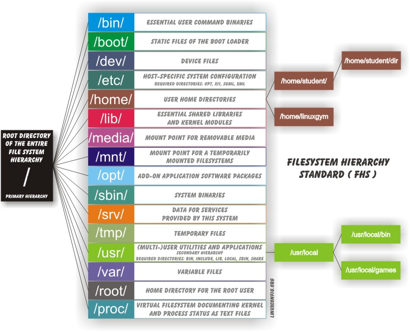

# Introduction into Linux

## What is it?
Linux is an open source computer operating system, initially developed on and for Intel x86-based personal computers. It has been subsequently ported to an astoundingly long list of other hardware platforms, from tiny embedded appliances to the world's largest supercomputers.

	

## History
Linus Torvalds was a student in Helsinki, Finland, in 1991, when he started a project: writing his own operating system kernel. He also collected together and/or developed the other essential ingredients required to construct an entire operating system with his kernel at the center. It wasn't long before this became known as the Linux kernel. 

In 1992, Linux was re-licensed using the General Public License (GPL) by GNU (a project of the Free Software Foundation or FSF, which promotes freely available software), which made it possible to build a worldwide community of developers. By combining the kernel with other system components from the GNU project, numerous other developers created complete systems called Linux distributions in the mid-90’s.

The Linux distributions created in the mid-90s provided the basis for fully free (in the sense of freedom, not zero cost) computing and became a driving force in the open source software movement. In 1998, major companies like IBM and Oracle announced their support for the Linux platform and began major development efforts as well.

Today, Linux powers more than half of the servers on the Internet, the majority of smartphones (via the Android system, which is built on top of Linux), and all of the world’s most powerful supercomputers.

Linus named his OS kernel Linux and shows a penguin as it mascot after a little incident at the zoo.

	

## Philosophy
Linux is constantly enhanced and maintained by a network of developers from all over the world collaborating over the Internet, with Linus Torvalds at the head. Technical skill, a desire to contribute, and the ability to collaborate with others are the only qualifications for participating.

Linux borrows heavily from the well-established UNIX operating system. It was written to be a free and open source system to be used in place of UNIX, which at the time was designed for computers much more powerful than PCs and was quite expensive. Files are stored in a hierarchical filesystem, with the top node of the system being the root or simply "/". Whenever possible, Linux makes its components available via files or objects that look like files. Processes, devices, and network sockets are all represented by file-like objects, and can often be worked with using the same utilities used for regular files. Linux is a fully multitasking (i.e. multiple threads of execution are performed simultaneously), multiuser operating system, with built-in networking and service processes known as daemons in the UNIX world.

__Note__: Linux was inspired by UNIX, but it is not UNIX.

## Terminology
**Kernel**: glue between hardware and applications. It controls the hardware and makes the hardware interact with the applications.

**Distribution**: collection of programs combined with the Linux kernelto make up a Linux-based operating system. For example: Redhat, Fedora, Ubuntu and Gentoo.

**Boot loader**: program that boots the operating system. Two examples of a boot loader are GRUB and ISOLINUX.

**Service**: program runs as a background process, some examples of the service are httpd, ftpd and named.

**Filesystem**: method for storing and organizing files, some examples of filesystems are ext3, ext4 and FAT.

**X Window system**: standard toolkit for build graphical subsystem on nearly all Linux systems (GNOME, KDE, Xfc)

**Command line**: interface for typing commands on top of the operating system

**Shell**: command line interpreter that interprets the command line input and instruct the operating system to perform any necessary tasks and commands.

## Distributions
The Linux kernel is the core of the operating system. A full Linux distribution consists of the kernel plus a number of other software tools for file-related operations, user management, and software package management. 

	

Large organizations, such as companies and governmental institutions and other entities, tend to choose the major commercially-supported distributions from Red Hat, SUSE, and Canonical (Ubuntu).

CentOS is a popular free alternative to Red Hat Enterprise Linux (RHEL) and is often used by organizations that are comfortable operating without paid technical support. Ubuntu and Fedora are widely used by developers and are also popular in the educational realm. Scientific Linux is favored by the scientific research community for its compatibility with scientific and mathematical software packages. Both CentOS and Scientific Linux are binary-compatible with RHEL; i.e. in most cases, binary software packages will install properly across the distributions.

## Boot process
The Linux boot process is the procedure for initializing the system. It consists of everything that happens from when the computer power is first switched on until the user interface is fully operational. 

1. **First step - BIOS**
	* Starting an x86-based Linux system involves a number of steps. When the computer is powered on, the Basic Input/Output System (BIOS) initializes the hardware, including the screen and keyboard, and tests the main memory. This process is also called POST (Power On Self Test).

	* The BIOS software is stored on a ROM chip on the motherboard. After this, the remainder of the boot process is controlled by the operating system (OS).

2. **Master Boot Record (MBR) and Boot Loader**
	* Once the POST is completed, the system control passes from the BIOS to the boot loader. The boot loader is usually stored on one of the hard disks in the system, either in the boot sector (for traditional BIOS/MBR systems) or the EFI partition (for more recent (Unified) Extensible Firmware Interface or EFI/UEFI systems).

	* A number of boot loaders exist for Linux; the most common ones are GRUB (for GRand Unified Boot loader), ISOLINUX (for booting from removable media), and DAS U-Boot (for booting on embedded devices/appliances). 

	* When booting Linux, the boot loader is responsible for loading the kernel image and the initial RAM disk or filesystem (which contains some critical files and device drivers needed to start the system) into memory.

3. **Text mode login**
	* Near the end of the boot process, init starts a number of text-mode login prompts. These enable you to type your username, followed by your password, and to eventually get a command shell. However, if you are running a system with a graphical login interface, you will not see these at first.

	

## Linux filesystems
A filesystem is a method of storing/finding files on a hard disk (usually in a partition). 

Think of a refrigerator that has multiple shelves that can be used for storing various items. These shelves help you organize the grocery items by shape, size, type, etc. The same concept applies to a filesystem, which is the embodiment of a method of storing and organizing arbitrary collections of data in a human-usable form.

Filesystems supported by Linux:

* Conventional disk filesystems: ext2, ext3, ext4, XFS, Btrfs, JFS, NTFS, etc.
* Flash storage filesystems: ubifs, JFFS2, YAFFS, etc.
* Database filesystems
* Special purpose filesystems: procfs, sysfs, tmpfs, squashfs, debugfs, etc.

**The Filesystem Hierarchy Standard**

Linux systems store their important files according to a standard layout called the Filesystem Hierarchy Standard (FHS), which has long been maintained by The Linux Foundation. Having a standard is designed to ensure that users, administrators, and developers can move between distributions without having to re-learn how the system is organized.

Linux uses the ‘/’ character to separate paths (unlike Windows, which uses ‘\’), and does not have drive letters. Multiple drives and/or partitions are mounted as directories in the single filesystem.

	

## Questions to ask when choosing a distributions
* What is the main function of the system (server or desktop)?
* What types of packages are important to the organization? For example, web server, word processing, etc.
* How much hard disk space is required and how much is available? For example, when installing Linux on an embedded device, space is usually constrained.
* How often are packages updated?
* How long is the support cycle for each release? For example, LTS releases have long-term support.
* Do you need kernel customization from the vendor or a third party?
* What hardware are you running on? For example, it might be X86, ARM, PPC, etc.
* Do you need long-term stability? Can you accept (or need) a more volatile cutting edge system running the latest software?

## Command line
Linux system administrators spend a significant amount of their time at a command line prompt. They often automate and troubleshoot tasks in this text environment. There is a saying, "graphical user interfaces make easy tasks easier, while command line interfaces make difficult tasks possible". Linux relies heavily on the abundance of command line tools. 

The command line interface provides the following advantages:

* No GUI overhead is incurred.
* Virtually any and every task can be accomplished while sitting at the command line.
* You can implement scripts for often-used (or easy-to-forget) tasks and series of procedures.
* You can sign into remote machines anywhere on the Internet.
* You can initiate graphical applications directly from the command line instead of hunting through menus.
* While graphical tools may vary among Linux distributions, the command line interface does not.

Most input lines entered at the shell prompt have three basic elements:

* Command
* Options
* Arguments

The command is the name of the program you are executing. It may be followed by one or more options (or switches) that modify what the command may do. Options usually start with one or two dashes, for example, -p or --print, in order to differentiate them from arguments, which represent what the command operates on.

However, plenty of commands have no options, no arguments, or neither. In addition, other elements (such as setting environment variables) can also appear on the command line when launching a task.

**Terminal emulator**

A terminal emulator program emulates (simulates) a standalone terminal within a window on the desktop. By this, we mean it behaves essentially as if you were logging into the machine at a pure text terminal with no running graphical interface. Most terminal emulator programs support multiple terminal sessions by opening additional tabs or windows.

**Virtual terminals**

Virtual Terminals (VT) are console sessions that use the entire display and keyboard outside of a graphical environment. Such terminals are considered "virtual" because, although there can be multiple active terminals, only one terminal remains visible at a time. A VT is not quite the same as a command line terminal window; you can have many of those visible at once on a graphical desktop.

To switch between VTs, press CTRL-ALT-function key for the VT. For example, press CTRL-ALT-F6 for VT 6. Actually, you only have to press the ALT-F6 key combination if you are in a VT and want to switch to another VT.

**Sudo**

The user with administrative (admin) privileges when required. sudo allows users to run programs using the security privileges of another user, generally root (superuser). The functionality of sudo is similar to that of run as in Windows.
