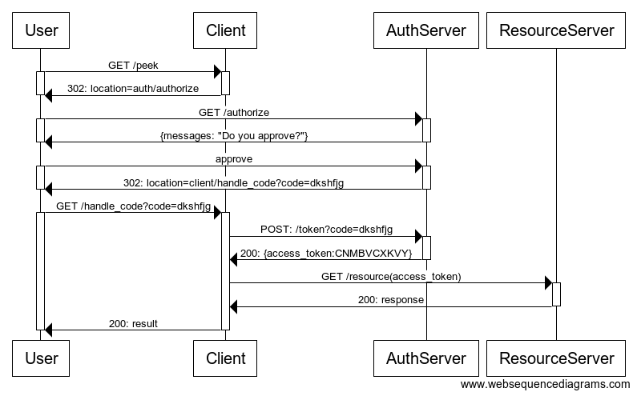

# OAuth2
## What is it?
OAuth is an open standard for access delegation, commonly used as a way for Internet users to grant websites or applications access to their information on other websites but without giving them the passwords.

This mechanism is used by companies such as Amazon, Google, Facebook, Microsoft and Twitter to permit the users to share information about their accounts with third party applications or websites.

Generally, OAuth provides to clients a "secure delegated access" to server resources on behalf of a resource owner. It specifies a process for resource owners to authorize third-party access to their server resources without sharing their credentials. Designed specifically to work with Hypertext Transfer Protocol (HTTP).

OAuth essentially allows access tokens to be issued to third-party clients by an authorization server, with the approval of the resource owner. The third party then uses the access token to access the protected resources hosted by the resource server

**Authentication**:  is about validating your credentials like User Name/User ID and password to verify your identity. 

**Authorization**: is the process to determine whether the authenticated user has access to the particular resources.

## Why Use OAuth 2.0?
* You can use OAuth 2.0 to read data of a user from another application.
* It supplies the authorization workflow for web, desktop applications, and mobile
devices.
* It is a server side web app that uses authorization code and does not interact with user credentials.

## Features
* OAuth 2.0 is a simple protocol that allows to access resources of the user without sharing passwords.
* It provides user agent flows for running clients application using a scripting language, such as JavaScript. Typically, a browser is a user agent.
* It accesses the data using tokens instead of using their credentials and stores data in online file system of the user such as Google Docs or Dropbox account.

## Advantages
* OAuth 2.0 is a very flexible protocol that relies on SSL (Secure Sockets Layer that ensures data between the web server and browsers remain private) to save user access token.
* OAuth 2.0 relies on SSL which is used to ensure cryptography industry protocols and are being used to keep the data safe.
* It allows limited access to the user's data and allows accessing when authorization tokens expire.
* It has ability to share data for users without having to release personal information.
* It is easier to implement and provides stronger authentication.

## Disadvantages
* If you are adding more extension at the ends in the specification, it will produce a wide range of non-interoperable implementations, which means you have to write separate pieces of code for Facebook, Google, etc.
* If your favorite sites are connected to the central hub and the central account is hacked, then it will lead to serious effects across several sites instead of just one.

## How it works?
